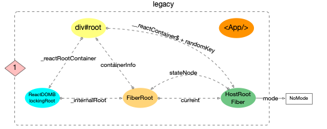

# react-learn

学习react源码,  先从读代码开始，从react17.0源码细读

通过卡颂源码和图解react配合学习，可以轻松领悟

学习源码不要陷进去，不要尝试去理解源码的每一行代码要点到为止，而是要理解源码的整体流程，以及每个流程的作用，然后再去深入理解每个流程的具体实现。

否则整体流程都不熟，细节你更难看懂

1. [卡颂参考链接](https://react.iamkasong.com/#%E7%AB%A0%E8%8A%82%E5%88%97%E8%A1%A8)
2. [图解react](https://7km.top/)
2. 个人xmind笔记(wps)
3. [build-your-own-react，构建迷你react，仅几百行代码](https://pomb.us/build-your-own-react/)

## 概念经验

> 整体流程概览图：https://7km.top/main/macro-structure

### 易混淆的关键变量

1. workInProgressRoot = root;// 当前要渲染的fiberRoot节点
2. workInProgress = createWorkInProgress(root.current, null); // 双缓存的rootFiber节点，存在这个变量和rootFiber的alternate属性上
3. workInProgressRootRenderLanes = subtreeRenderLanes = workInProgressRootIncludedLanes = lanes; 

### 常见概念

1. fiber树，每个fiber节点存着一个Update链表，这个链表就是更新队列，里面保存着所有的更新操作，当fiber树更新时，会遍历这个链表，依次执行更新操作，完成更新。
    - 还存着一个effects 链表，保存着此次更新所有需要执行的effect，在commit阶段，会遍历这个链表，依次执行effect。
    - ReactElement树驱动fiber树, fiber树再驱动DOM树, 最后展现到页面上，
2. fiber根节点结构：从ReactDOM.render开始
    - fiberRoot：一个 React 根实例的内部表示，管理整个应用的根节点，包括初始化、更新和生命周期管理，有current属性，被赋予于container容器dom的一个私有属性
      - **双缓存体系中缓存树最顶端只有一个fiberRoot**（而且不是fiber节点类型对象）
        - 缓存树是从hostRootFIber开始的，rootFiber.parent为空，fiber意义上的父节点为空，向上只有个单独的current链接
      - 下一端用current链接，current来切换缓存的2个树，更新时双缓存树就用这个current属性来切换
    - rootFiber：上面current值。fiberRoot 中的一个 Fiber 节点，表示 React 应用的根节点，作为整个 Fiber 树的起点
      - 也叫HostRoot 类型组件
    ```js
    import React from 'react';
    import ReactDOM from 'react-dom/client';
    const container = document.getElementById('root');
    const root = ReactDOM.createRoot(container);
    root.render(<App />);
    // 关系如下：
      fiberRoot
      |
      +---> current: rootFiber
          |
          +---> tag: HostRoot
          |
          +---> stateNode: fiberRoot
          |
          +---> child: appFiber 即 <App /> react元素树对应的fiber链表树
    ```
3. 两大workLoop工作循环：
  - 协调器workLoop：构造fiber树时，beginWork，completeWork
  - 调度器workLoop：整体调度更新任务队列
4. 双缓存技术
  - 双缓存是缓存rootFiber根节点开始。rootFiber的alternate值就是缓存的另一份B版rootFiber。B版rootFiber节点为方便赋值全局变量workInProgress：当前缓存rootFiber节点
    - workInProgress的创建见workLoop阶段的方法定义处：react/packages/react-reconciler/src/ReactFiberWorkLoop.old.js
    - performSyncWorkOnRoot --> renderRootSync  --> prepareFreshStack ---> createWorkInProgress方法
5. 执行工作循环 performUnitOfWork时，beginWork里有处理sibling返回wip.child,而归时completeWork时也会处理sibling，待细看？
  - 整个fiber树的diff对比是深度优先遍历
  - beginWork里处理的sibling，是为了提前找出当前同级所有节点，然后工作循环不断执行beginWOrk的是其child属性：从外到内的方向
    - beginWork中只处理child属性不处理sibling属性，只生成sibling属性不处理sibling属性，
  - 当前一直深度优先child时，如果child为null，开始执行completeWork，这方法中会处理sibling属性：从内到外的方向
6. workInProgressRoot：指向唯一的fiberRoot节点，初始值为null。赋值fiberRoot在renderRootSync的刷新栈帧prepareFreshStack方法中赋值
7. react中fiber中大体分为两类属性，同时生命周期钩子也是对应分为这两类 --- 见状态更新刨析章节
  - 状态属性: 用于fiber树构造过程，一般对应useState，getDerivedStateFromProps等状态类钩子中使用
  - 副作用属性：用于commit阶段，一把对应useEffect，getSnapshotBeforeUpdate，componentDidMount等副作用类钩子中使用
8. 环形链表的特征: 为了方便添加新元素和快速拿到队首元素(都是O(1)), 所以pending指针指向了链表中最后一个元素
9. Hooks中
  - schedulePassiveEffects是填充Passsive全局数组，flushPassiveEffects是触发全局数组里存的副作用调度执行
  - 执行effect.destroy()的地方有两个:1.组件销毁时commitDeletion中commitUnmount中, 执行effect.destroy()；2. flushPassiveEffects中
10. fiber树构造
  - 对比更新时：进入工作循环即beginWork前
      - 双缓存结构的workInProgress fiber节点树进行初始化为除了rootFiber是复制的新节点，其余child的fiber树是直接与current.child是共用的
          - 详见[章节](#markupdatelanefromfibertoroot) 的`renderRootSync源码`部分

### mode与优先级和通道lanes概念

> 参考图解react[启动模式](https://7km.top/main/bootstrap) + [lanes](https://7km.top/main/priority) 基本可以懂
> 通过fiber上的lane优先级的灵活运用, React实现了可中断渲染,时间切片(time slicing),异步渲染(suspense)等特性

1. 共有3种优先级模型贯穿于整个react体系。
    - fiber优先级(LanePriority): 位于react-reconciler包, 也就是Lane(车道模型).
      - 18个lane通道定义：packages/react-reconciler/src/ReactFiberLane.js#L74-L103
      - 使用31个比特位来表示
      - 每个lane通道都有对应的优先级所以：18个通道优先级：lanePriority: react/packages/react-reconciler/src/ReactFiberLane.js
    - 调度优先级(SchedulerPriority): 位于scheduler包.
      - 6大调度优先级Prority：packages/scheduler/src/SchedulerPriorities.js
    - 优先级等级(ReactPriorityLevel) : 位于react-reconciler包中的SchedulerWithReactIntegration.js, 负责上述 2 套优先级体系的转换.
      - 协同调度中心(scheduler包)和 fiber 树构造(react-reconciler包)中对优先级的使用, 则需要转换SchedulerPriority和LanePriority, 转换的桥梁正是ReactPriorityLevel
2. 优先级的使用处：主要用来控制调度器中 任务调度循环中循环的顺序


## react17学习

直接在react源码中标注研究即可

### 疑问

1. performSyncWorkOnRoot方法中：为什么flushPassiveEffects执行副作用函数 为什么会在render阶段beginWOrk前执行，也会在commit阶段起始执行？不都是执行副作用钩子的吗
2. unstable_runWithPriority 与unstable_scheduleCallback 区别？都会使用其执行了flushPassiveEffects
3. commit阶段中commitMutationEffects方法中，遍历effectList执行不同flags的节点逻辑，然后commitPlacement内部也是递归处理所有子节点，那外面的遍历会冲突吗？？
    - react/packages/react-reconciler/src/ReactFiberWorkLoop.old.js:2550
    - 大体看图解理解：effectList链表是子节点靠前，父节点靠后的顺序链接起来的，如先遍历图解示例中的Content fiber节点，递归处理所有子Host类型节点，然后下次遍历到App fiber节点，就跳过了
    - TODO：待实际DEBUGGER一下
4. FunctionComponentUpdateQueue副作用队列中的 destroy和tag。不同tag的区别，有点模糊。const {destroy, tag} = effect;导致在react/packages/react-reconciler/src/ReactFiberCommitWork.old.js的commitUnmount中根据tag的2种判断逻辑

### 常见数据结构

```js
// 数据结构详见：https://7km.top/main/object-structure 解读。

// ReactElement 对象结构 todu
function List () {
  return (
    <ul>
      <li key="0">0</li>
      <li key="1">1</li>
      <li key="2">2</li>
      <li key="3">3</li>
    </ul>
  )
}
// ==== 对应下面的reactElement 元素类型 ====
{
  $$typeof: Symbol(react.element),
  key: null,
  props: {
    children: [
      {$$typeof: Symbol(react.element), type: "li", key: "0", ref: null, props: {…}, …}
      {$$typeof: Symbol(react.element), type: "li", key: "1", ref: null, props: {…}, …}
      {$$typeof: Symbol(react.element), type: "li", key: "2", ref: null, props: {…}, …}
      {$$typeof: Symbol(react.element), type: "li", key: "3", ref: null, props: {…}, …}
    ]
  },
  ref: null,
  type: "ul"
}

// fiberRoot结构 定义见react/packages/react-reconciler/src/ReactInternalTypes.js
export type FiberRoot = {
  ...BaseFiberRootProperties,
  ...ProfilingOnlyFiberRootProperties,
  ...SuspenseCallbackOnlyFiberRootProperties,
  // 如下面是BaseFiberRootProperties部分属性
  ...{// 这些lanes相关属性只在fiberRoot节点有，用于统一计算fiber树的更新优先级
  pendingLanes: Lanes,
  suspendedLanes: Lanes,
  pingedLanes: Lanes,
  expiredLanes: Lanes,
  mutableReadLanes: Lanes,

  finishedLanes: Lanes,

  entangledLanes: Lanes,
  entanglements: LaneMap<Lanes>,
  }
};

// 创建fiber节点定义处包括rootFiber：react/packages/react-reconciler/src/ReactFiber.old.js
// fiber 数据结构，了解了他，react基本上也懂差不多了
function FiberNode(// fiber类型声明：react/packages/react-reconciler/src/ReactInternalTypes.js
  tag: WorkTag,
  pendingProps: mixed,
  key: null | string,
  mode: TypeOfMode,
) {
  // 作为静态数据结构的属性
  // HostRoot (3)：根节点。
  // ClassComponent (1)：类组件。
  // FunctionComponent (0)：函数组件。
  // ContextProvider (8)：上下文提供者。
  // ContextConsumer (7)：上下文消费者。
  // HostComponent (5)：原生 DOM 节点。
  // HostText (6)：文本节点。
  this.tag = tag; // 定义见react/packages/react-reconciler/src/ReactWorkTags.js
  this.key = key;
  // elementType就是reactElement对象的type类型，存储在fiber的elementType上
  this.elementType = null;
  // 存储的组件原声明对象：如Appclasscomponent或AppFunction, 要是react内部提供的组件则有单独的类型定义用16进制表示：react/packages/shared/ReactSymbols.js
  this.type = null;
  // 类组件 (ClassComponent)：stateNode 存储的是类组件的实例。
  // 函数组件 (FunctionComponent)：stateNode 通常是 null。
  // 根组件 (HostRoot就是rootFiber节点)：stateNode 存储的是一个包含上下文信息的对象。定义见react/packages/react-reconciler/src/ReactInternalTypes.js
  // 文本节点 (HostText)：stateNode 存储的是实际的文本内容。
  // 原生 DOM 节点 (HostComponent)：stateNode 存储的是对应的 DOM 元素
  this.stateNode = null; // 存储的组件实例

  // 用于连接其他Fiber节点形成Fiber树
  this.return = null;
  // workInProgress.child值就是App起始的fiber树了
  this.child = null;
  this.sibling = null;
  // 标识当前Fiber 节点在其父节点的子节点列表中的位置
  this.index = 0;

  this.ref = null;

  // 作为动态的工作单元的属性
  //  // 等待更新的props：1-在TODO创建fiber节点时（react/packages/react-reconciler/src/ReactFiber.old.js）中定义。2-processUpdateQueue中处理
  // // ReactElements树创建fiber节点时
  // // 1. props.children 可以直接传入当作pendingProps
  // // 2. element.props作为pendingProps【const pendingProps = element.props】
  this.pendingProps = pendingProps;
  this.memoizedProps = null; // 上次计算好的最终props新值---- pendingProps和memoizedProps比较可以得出属性是否变动.

  // updateQueue 属性在类组件和函数组件中的结构不一样，都是存着各自结构的副作用队列
  // 1. class组件：存生命周期钩子componentDidMount类的副作用队列。宿主组件存储 某个组件状态更新产生的 Updates链表 的地方，是以queue为类型保存的 ==== 类型定义：react/packages/react-reconciler/src/ReactUpdateQueue.old.js
  // 2. 函数组件：存useEffect之类的副作用队列，详见hooks章节
  // 3. HostComponent: 是数组类型，奇数索引为DOM更新的key，偶数索引为value ---> 这个数组值是completeWork时针对Host类型组件更新的updateQueue值
  this.updateQueue: queue = null; // 状态更新创建Update链表，然后推入到这个updateQueue，等待再beginWork中处理，处理方法在react/packages/react-reconciler/src/ReactUpdateQueue.old.js:processUpdateQueue

  // 保存当前组件状态更新计算后准备更新的state
  // 类组件存储fiber的状态，函数组件存储hooks链表. 在function类型的组件中, fiber.memoizedState就指向Hook队列(Hook队列保存了function类型的组件状态).
  // 所以classComponent和Hook都不能脱离fiber而存在
  this.memoizedState: hook = null; // processUpdateQueue最新计算后的fiber.updateQueue.baseState同时也赋值给了fiber.memoizedState

  // dependencies属性会在更新时使用
  // 主要在Context上下文更新时，用来广播所有子树中依赖这个Context的，判断标准就是fiber节点的dependencies中是否有对应的Context
  // 详见：更新Context 章节
  this.dependencies = null;

  this.mode = mode;

  /**
   * flags与effectList链表是成对存在的，firstEffect链接的是有副作用的fiber节点，该fiber节点上必须会含对应的副作用标记flags
   * 
   * 标志位, 表明该fiber节点有副作用(在 v17.0.2 中共定义了28 种副作用).
   */
  // flags 标记，在beginWork和completeWork都可能会设置。对fiber节点到commit阶段的DOM操作标记：增删改等
  this.flags = Flags; // 定义：react/packages/react-reconciler/src/ReactFiberFlags.js
  this.subtreeFlags = Flags;
  // reconcileChildFibers更新阶段会为生成的Fiber节点带上effectTag属性，而mount阶段mountChildFibers不会，
  // 在mount时只有rootFiber会赋值Placement effectTag，在commit阶段只会执行一次插入操作
  this.effectTag = NoEffect; // 这个是针对于单个fiber节点上要副作用的标记类型，如Update标记，Placement标记
  // 这个链表一般针对于rootFiber根节点上：存储effectList链表的，commit阶段只要遍历这个链表，即可完成渲染dom,
  this.nextEffect = null; // 链表链接的是fiber节点类型
  this.firstEffect = null;
  this.lastEffect = null;

  // 调度优先级相关
  // fiber.lanes：为 NoLanes（没有其他待处理的更新,表明接下来这个是第一次更新）
  this.lanes = NoLanes; // 当前节点的一组更新通道：默认值是ob0000000 NoLanes 无优先级通道
  /**
   * 当一个更新请求被调度到某个 Fiber 节点的子节点时，新的车道会被合并到父节点的 childLanes 属性中
   * 
   * 一直向上遍历到根节点，给所有父节点都合并当前节点的lane属性，原因如下：
   * 1. 父节点统一管理更新： App 节点有多个子节点，每个子节点都可能有独立的更新请求。通过更新 childLanes，App 节点可以集中管理这些更新请求，确保在一次渲染周期中处理所有相关的更新
   * 2. 优先级管理：如果 Header 节点和 Footer 节点都有更新请求，但 Header 节点的更新请求优先级更高，父节点可以通过 childLanes 属性来决定先处理 Header 节点的更新
   * 3. 传递更新信息：当一个子节点接收到更新请求时，仅更新该子节点的 lanes 属性是不够的。父节点也需要知道这个更新请求的存在，以便在需要时重新渲染整个子树
   */
  this.childLanes = NoLanes;// 所有子树节点的更新通道

  /**
   *初始渲染：
      当初次渲染组件时，React 会构建一个 Fiber 树，这些 Fiber 节点的 alternate 属性初始为 null。
    更新过程：
      当组件需要更新时，React 会创建一个新的 Fiber 树（work-in-progress tree），这个新树中的每个 Fiber 节点都会有一个 alternate 属性，指向当前 Fiber 树（current tree）中的相应节点。
      在新的 Fiber 树构建完成后，React 会将 current 树指针切换到新的 Fiber 树，完成更新。
    交替指针：
      每个 Fiber 节点的 alternate 属性会在每次更新时交换指向，确保当前树和工作树之间的双向链接。
   */
  this.alternate = null; // 用于双缓存技术，指向上一次渲染的fiber节点
}

```

### 调试源码

> https://www.twotwoba.site/blog/frame/react-source-debug

1. 根据文档教程，先构建完包，react内link一下，再去cra项目中link下你构建完的17版的包即可
  - yarn安装依赖坑
    - 需要node14版本+java-jdk环境
  - 打包命令：`yarn build react/index,react/jsx,react-dom/index,scheduler --type=NODE`
2. 新脚手架用得react18语法，所以改成17的语法就行

#### 改动了react源码后续进行增量调试

1. react源码增加调试代码
2. react目录下: 执行打包命令：`yarn build react/index,react/jsx,react-dom/index,scheduler --type=NODE`
3. 直接就可以在react-test项目中启动看效果了
  - 下面不用了，因为link过了，react-lear/react/build这块构建内容变化，会自动响应到react-test项目中依赖中
  - 去/react/build/node_modules/react下：pnpm link -g
  - 去react/build/node_modules/react-dom下：pnpm link -g  ==== 将构建完的调试源码包重新link到全局
  - 由于第一次在react-test项目中已经link过了react源码包，所以可以不需要这步，直接启动看效果


### 状态更新流程

主要发生在react/packages/react-reconciler/src/ReactFiberReconciler.old.js-updateContainer函数里

```js

0-触发状态更新（根据场景调用不同方法）
    |
    |
    v
1-创建Update对象
    |
    |
    v
2-从fiber到root ---- 在调度更新函数(scheduleUpdateOnFiber)中执行的（`markUpdateLaneFromFiberToRoot`）
    |这个fiber是当前页面上的即current fiber节点开始向上追溯
    |向上找到rootFiber，沿途标记更新通道childLanes，并更新对应的alternate上
    |   - 这个childLanes会在beginWork的bailoutOnAlreadyFinishedWork优化方法中会用到：用来判断当前fiber的子节点的有没有更新，若没有更新可以直接复用      
    |
    v
3-调度更新（`ensureRootIsScheduled`）
    |根据Update的优先级调度此次异步更新还是同步更新
    |调度的回调单元：`performSyncWorkOnRoot` 或 `performConcurrentWorkOnRoot`，含执行下面2个阶段（地址：react/packages/react-reconciler/src/ReactFiberWorkLoop.old.js:1074）
    v
3-1-render阶段（`renderRootSync`）
    |执行工作循环`workLoopSync` -----> 执行循环单元`performUnitOfWork`,完成下面的beginWork+completeWork完成fiber树的构造
    |beginWork阶段：
      |剪掉queue.share.pending单项环状链表，并赋值给queue.baseUpdate
      |依据queue.baseUpdate和queue.baseState计算新的state赋值给fiber.memoizedState
    |completeWork阶段
      |创建effect链表即effectTag
    v
3-2-commit阶段（`commitRoot`）
    |

```

- Update对象：Update对象组成UpdateQueue链表，
- UpdateQueue结构
  - HostComponent组件：数组结构;UpdateQueue格式为 名叫updatePayload为数组形式，他的偶数索引的值为变化的prop key，奇数索引的值为变化的prop value
  - ClassComponent和HostRoot组件：链表结构
      ```js
      // 这是类组件的Update数据结构：定义在react/packages/react-reconciler/src/ReactUpdateQueue.old.js
      const update: Update<*> = {
        eventTime,
        lane, // 此次更新事务的优先级
        suspenseConfig,
        /**
         * 初次mount时，update的tag为 0：定义在 react/packages/react-reconciler/src/ReactUpdateQueue.old.js
         *  export const UpdateState = 0;
            export const ReplaceState = 1;
            export const ForceUpdate = 2;
            export const CaptureUpdate = 3;
         */
        tag: UpdateState, 
        payload: null,
        callback: null,
        next: null,
      };
      const queue: UpdateQueue<State> = {
        baseState: fiber.memoizedState,
        firstBaseUpdate: null, // 保存上次更新遗留的update链表
        lastBaseUpdate: null,
        shared: {
          pending: update,// 保存此次更新的update的链表
        },
        effects: null,
      };
      // beginWork时：遍历baseUpdate链表在baseState基础上计算最终要更新的state, 并赋值给fiber.memoizedState
      ```
  - FunctionComponent组件：就是下面章节的Hooks数据结构，与类组件的有区别

#### 状态更新刨析

> 参考https://7km.top/main/state-effects

```js
export type Fiber = {|
  // 1. fiber节点自身状态相关
  pendingProps: any,
  memoizedProps: any,
  updateQueue: mixed,
  memoizedState: any,

  // 2. fiber节点副作用(Effect)相关
  flags: Flags,
  subtreeFlags: Flags, // v17.0.2未启用
  deletions: Array<Fiber> | null, // v17.0.2未启用
  nextEffect: Fiber | null,
  firstEffect: Fiber | null,
  lastEffect: Fiber | null,
|};
```

##### 与状态相关有 4 个属性: --- 静态能力

- fiber.pendingProps: 输入属性, 从ReactElement对象传入的 props. 它和fiber.memoizedProps比较可以得出属性是否变动.
- fiber.memoizedProps: 上一次生成子节点时用到的属性, 生成子节点之后保持在内存中. 向下生成子节点之前叫做pendingProps, 生成子节点之后会把pendingProps赋值 -   memoizedProps用于下一次比较.pendingProps和memoizedProps比较可以得出属性是否变动.
- fiber.updateQueue: 存储update更新对象的队列, 每一次发起更新, 都需要在该队列上创建一个update对象.
- fiber.memoizedState: 上一次生成子节点之后保持在内存中的局部状态.

它们的作用只局限于fiber树构造阶段, 直接影响子节点的生成

##### 副作用 --- 动态能力
与副作用相关有 4 个属性:

- fiber.flags: 标志位, 表明该fiber节点有副作用(在 v17.0.2 中共定义了28 种副作用).
- fiber.nextEffect: 单向链表, 指向下一个副作用 fiber节点.
- fiber.firstEffect: 单向链表, 指向第一个副作用 fiber 节点.
- fiber.lastEffect: 单向链表, 指向最后一个副作用 fiber 节点.

通过前文fiber树构造我们知道, 单个fiber节点的副作用队列最后都会上移到根节点上. 所以在commitRoot阶段中, react提供了 3 种处理副作用的方式(详见fiber 树渲染其commit那3个子阶段都是来处理这些副作用).

另外, 副作用的设计可以理解为对状态功能不足的补充.

- 状态是一个静态的功能, 它只能为子节点提供数据源.
- 而副作用是一个动态功能, 由于它的调用时机是在fiber树渲染阶段, 故它拥有更多的能力, 能轻松获取突变前快照, 突变后的DOM节点等. 甚至通过调用api发起新的一轮fiber树构造, 进而改变更多的状态, 引发更多的副作用

### 深入理解优先级
- react为产生的不同的状态更新类型赋予不同的优先级：
  生命周期方法：同步执行。
  受控的用户输入：比如输入框内输入文字，同步执行。
  交互事件：比如动画，高优先级执行。
  其他：比如数据请求，低优先级执行

- 优先级字段是Update对象的lane字段

### fiber树构造

参考博客：https://7km.top/main/fibertree-update

参考下面章节：[ReactDOM.render流程](#reactdomrender流程)

#### 整体数据结构变化



按照上面图解知：

##### 启动阶段：
1. 初次构造启动时，页面上只有div#root的容器dom，且children为空
2. 执行入口渲染方法，且在调用updateContainer之前，内存中创建fiberRoot 对象，并赋值给`div#root._reactRootContainer._internalRoot`与页面容器dom进行了关联。
    - 同时fiberRoot直接初始化current属性为HostRootFiber:A 节点（作为fiber树的根节点） ---> ***此时页面容器dom里上还是空的***

##### render阶段：
1. scheduleUpdateOnFiber-performSyncWorkOnRoot-renderRootSync中
2. prepareFreshStack方法中：会创建HostRootFiber:B 双缓存树的副本节点B，在容器DOM中的存在形式为`HostRootFiber:A.alternate = HostRootFiber:B`
3. 构造循环workLoopSync方法中：后续组件树-fiber树的构造都是在HostRootFiber:B上进行，在render阶段beginWork+completeWork后完整的fiber树构建完了
    - 构造完后还会将这个rooFiber:B树会赋值给`fiberRoot.finishedWork`

##### commit阶段
1. 最终commitRoot-commitMutationEffects阶段方法中：操作完DOM后 ---> ***此时页面容器dom有内容了***
    - 有内容后同时改变指针：将`fiberRoot.current`指针指向`fiberRoot.finishedWork`：此时HostRootFiber:B代表页面上的树，HostRootFiber:A代表fiber备用缓存的树
    - 此时也形成了页面和内存同时存在的双缓存fiber树，便于后面diff对比时使用两者
2. 后面update更新时：在`fiberRoot.current.alternate:HostRootFiber:A`上进行构造新fiber树,然后对应地再current指向A，再然后B上构造新树current指向B，... B->A,A->B 这样相互交替达到双缓存更新的效果

#### 初次构造

> 重点关注图解结构方面：https://7km.top/main/fibertree-create

#### 对比更新

参考博客：https://7km.top/main/fibertree-update

本节讨论对比更新这种情况(在Legacy模式下进行分析). 在阅读本节之前, 最好对fiber 树构造(初次创建)有一些了解, 其中有很多相似逻辑不再重复叙述, 本节重点突出对比更新与初次创建的不同之处

测试代码为：react-test/src/testClassUpdate.jsx


##### 更新入口

如要主动发起更新, 有 3 种常见方式-- 3种方式具体对比介绍见[章节锚点or博客链接](#状态更新API入手):
- Class组件中调用setState.
- Function组件中调用hook对象暴露出的dispatchAction.
- 在container节点上重复调用render(官网示例)
  ```js
  import ReactDOM from 'react-dom';
  function tick() {
    const element = (
      <div>
        <h1>Hello, world!</h1>
        <h2>It is {new Date().toLocaleTimeString()}.</h2>
      </div>
    );
    ReactDOM.render(element, document.getElementById('root'));
  }
  setInterval(tick, 1000);
  // 对于重复render, 在React 应用的启动过程中已有说明, 调用路径包含updateContainer-->scheduleUpdateOnFiber
  ```

故无论从哪个入口进行更新, 最终都会进入scheduleUpdateOnFiber 调度更新, 再次证明scheduleUpdateOnFiber是输入阶段的必经函数(参考reconciler 运作流程).

- **状态更新时触发调度更新的fiber传参：应该都是current即页面上的 当前fiber节点**

##### 更新的构造阶段

逻辑来到 scheduleUpdateOnFiber 函数逻辑
代码定义：react/packages/react-reconciler/src/ReactFiberWorkLoop.old.js@scheduleUpdateOnFiber

**scheduleUpdateOnFiber相关逻辑链路理解**

可参考图解https://7km.top/main/fibertree-update#markupdatelanefromfibertoroot

1. 状态更新触发调度更新后，先执行其逻辑中的markUpdateLaneFromFiberToRoot，从current级别当前fiber节点向上至rootFiber及对应alternate都标记更新lanes
  - 此时双缓存的workInProgress树目前还只是一个空的rootFiber节点没有children，这一步只是给当前都加上lanes了
2. ensureRootIsScheduled(performSyncWorkOnRoot)：根据上下文发起调度更新：
  - 调度更新开始执行刷新栈帧：这时会设置双缓存树即workInProgress子树为current的child：与current的child公有同一份child,并重置workInProgress的一些flags和effects链表等关键属性

###### markUpdateLaneFromFiberToRoot

图解见 https://7km.top/main/fibertree-update#markupdatelanefromfibertoroot

函数主要任务：

1. 以sourceFiber就是传入的current级别的fiber为起点, 设置起点的fiber.lanes
2. 从起点开始, 直到HostRootFiber, 设置父路径上所有节点(也包括fiber.alternate)的fiber.childLanes.
3. 通过设置fiber.lanes和fiber.childLanes就可以辅助判断子树是否需要更新(在下文循环构造中详细说明)

**初次构造与对比更新的不同点**

1. markUpdateLaneFromFiberToRoot函数, 只在对比更新阶段才发挥出它的作用, 它找出了fiber树中受到本次update影响的所有节点, 并设置这些节点的fiber.lanes或fiber.childLanes(在legacy模式下为SyncLane)以备fiber树构造阶段使用
2. 对比更新没有直接调用performSyncWorkOnRoot, 而是通过调度中心来处理, 由于本示例是在Legacy模式下进行, 最后会同步执行performSyncWorkOnRoot.(详细原理可以参考React 调度原理(scheduler)). 所以其调用链路performSyncWorkOnRoot--->renderRootSync--->workLoopSync与初次构造中的一致.
3. renderRootSync源码中：进入循环构造(workLoopSync)前, 会刷新栈帧(调用prepareFreshStack)(参考fiber 树构造(基础准备)中栈帧管理).
    - fiberRoot.current指向与当前页面对应的fiber树, workInProgress指向正在构造的fiber树.
    - 刷新栈帧prepareFreshStack：刷新栈帧会调用createWorkInProgress(), 使得workInProgress.flags和workInProgress.effects都已经被重置. 且workInProgress.child = current.child. 所以在进入循环构造之前, HostRootFiber与HostRootFiber.alternate共用一个child(这里是fiber(<App/>)).
        - **共用一个child原因**：是默认child没有更新可以完全复用，后面如果有更新的话再单独clone或新建fiber节点到wip的树上
            - clone时，是clone当前fiber节点，克隆后的子fiber节点并没有克隆，还是链接的current级别的
        - 图解结构见https://7km.top/main/fibertree-update#markupdatelanefromfibertoroot

###### 工作循环构造

整个fiber树构造是一个深度优先遍历(可参考React 算法之深度优先遍历), 其中有 2 个重要的变量workInProgress和current(可参考fiber 树构造(基础准备)中介绍的双缓冲技术)

- workInProgress和current都视为指针
- workInProgress指向当前正在构造的fiber节点
- current = workInProgress.alternate(即fiber.alternate), 指向当前页面正在使用的fiber节点.

1. 在深度优先遍历中, 每个fiber节点都会经历 2 个阶段:
  - 探寻阶段 beginWork
  - 回溯阶段 completeWork
这 2 个阶段共同完成了每一个fiber节点的创建(或更新), 所有fiber节点则构成了fiber树

2. 接下来主要分享 workLoopSync 方法逻辑
代码见：react/packages/react-reconciler/src/ReactFiberWorkLoop.old.js@workLoopSync
```js
/**
 * 从workInProgress起从上到下循环执行 performUnitOfWork
 * 
 * @param workInProgress 全局变量 wip的rootFiber 缓存根节点，不管mount还是update都是从根节点开始向下遍历
 */
function workLoopSync() {
  // 判断workInProgress值，从rootFiber内存fiber节点开始，不断赋值workInProgress变量， 一直向下深度优先遍历
  while (workInProgress !== null) {
    performUnitOfWork(workInProgress);
  }
}
// ... 省略部分无关代码
function performUnitOfWork(unitOfWork: Fiber): void {
  // unitOfWork就是被传入的workInProgress，不管mount还是update，第一次的值都是rootFiber的副本节点，自顶向下递归处理
  // 在对比更新过程中current = unitOfWork.alternate;不为null, 后续的调用逻辑中会大量使用此处传入的current
  const current = unitOfWork.alternate;
  let next;
  next = beginWork(current, unitOfWork, subtreeRenderLanes);
  unitOfWork.memoizedProps = unitOfWork.pendingProps;
  if (next === null) {
    // 如果没有派生出新的节点, 则进入completeWork阶段, 传入的是当前unitOfWork
    completeUnitOfWork(unitOfWork);
  } else {
    workInProgress = next;
  }
}
```

###### 探寻阶段 beginWork

代码见：react/packages/react-reconciler/src/ReactFiberBeginWork.old.js@beginWork

**1. bailoutOnAlreadyFinishedWork逻辑**
  - 全局搜索`function bailoutOnAlreadyFinishedWork(`查看逻辑和注释
  - bailout用于判断子树节点是否完全复用, 如果可以复用, 则会略过 fiber 树构造

**2. updateXXX函数**
  - updateXXX函数(如: updateHostRoot, updateClassComponent 等)的主干逻辑与初次构造过程完全一致, 总的目的是为了向下生成子节点, 并在这个过程中调用reconcileChildren调和函数, 只要fiber节点有副作用, 就会把特殊操作设置到fiber.flags(如:节点ref,class组件的生命周期,function组件的hook,节点删除等).

**3. 对比更新过程的不同之处:**
  - bailoutOnAlreadyFinishedWork
    对比更新时如果遇到当前节点无需更新(如: class类型的节点且shouldComponentUpdate返回false), 会再次进入bailout逻辑.
  - reconcileChildren调和函数：调和函数是updateXXX函数中的一项重要逻辑, 它的作用是向下生成子节点, 并设置fiber.flags.
    初次创建时fiber节点没有比较对象, 所以在向下生成子节点的时候没有任何多余的逻辑, 只管创建就行.
    对比更新时需要把ReactElement对象与旧fiber对象进行比较, 来判断是否需要复用旧fiber对象
  - 调和函数目的:
    - 给新增,移动,和删除节点设置fiber.flags(新增,移动: Placement, 删除: Deletion)
    - 如果是需要删除的fiber, 除了自身打上Deletion之外, 还要将其添加到父节点的effects链表中(正常副作用队列的处理是在completeWork函数, 但是该节点(被删除)会脱离fiber树, 不会再进入completeWork阶段, 所以在beginWork阶段提前加入副作用队列).


###### 回溯阶段 completeWork

completeUnitOfWork(unitOfWork)函数(源码地址)在初次创建和对比更新逻辑一致,
都是处理beginWork 阶段已经创建出来的 fiber 节点, 最后创建(更新)DOM 对象, 并上移副作用队列

##### 图解理解

见https://7km.top/main/fibertree-update

最后 complete一直向上归到hostRootFiber节点时其parent节点为空，到此整个fiber树构造循环(对比更新)已经执行完毕, 拥有一棵新的fiber树, 并且在fiber树的根节点上挂载了副作用队列. renderRootSync函数退出之前, 会重置workInProgressRoot = null, 表明没有正在进行中的render. 且把最新的fiber树挂载到fiberRoot.finishedWork上. 这时整个 fiber 树的内存结构如下(注意fiberRoot.finishedWork和fiberRoot.current指针,在commitRoot阶段会进行处理)

##### 总结

本节演示了更新阶段fiber树构造(对比更新)的全部过程, 跟踪了创建过程中内存引用的变化情况. 与初次构造最大的不同在于fiber节点是否可以复用, 其中bailout逻辑是fiber子树能否复用的判断依据
      
### 状态更新API入手

#### ReactDOM.render流程

> 相关博客解读可参考https://7km.top/main/bootstrap和 卡颂的章节

**大体流程**
1. 创建fiberRootNode和rootFiber和初始化UpdateQueue ====== 后面都主要发生在react/packages/react-reconciler/src/ReactFiberReconciler.old.js updateContainer函数里
2. 创建Update对象，并赋值给rootFiber.updateQueue,来触发一次更新
3. 从fiber到root  --- 在调度更新函数：scheduleUpdateOnFiber中执行的
4. 调度更新：scheduleUpdateOnFiber
5. render阶段
6. commit阶段

**源码刨析**
1. 入口文件：react/packages/react-dom/src/client/ReactDOM.js 的引入的render方法
    ```js
    render-->legacyRenderSubtreeIntoContainer---> 1. legacyCreateRootFromDOMContainer
                                            |         - createLegacyRoot -> ReactDOMBlockingRoot -> createRootImpl    
                                            |---> 2. updateContainer
    ```
2. render方法定义路径：react/packages/react-dom/src/client/ReactDOMLegacy.js ----> 内部调用legacyRenderSubtreeIntoContainer 为render的1级核心方法 --> 方法内部再下面：
  1. 先legacyCreateRootFromDOMContainer初始化fiberRoot应用根节点
      - mount阶段下更改执行上下文为非批量更新执行上下文，确保mount初始挂载可以立即更新，不调度
      消费这个上下文是在后面的 scheduleUpdateOnFiber 中判断执行
      - 创建fiberRoot对象
  2. 再调用协调器的 updateContainer----> scheduleUpdateOnFiber调度更新 为render的2级核心方法,该方法任何render相关的API最终都会调用它
      - 先从fiber到root沿途标记lanes
      - 后调用`performSyncWorkOnRoot`,执行下面2阶段:react/packages/react-reconciler/src/ReactFiberWorkLoop.old.js:1074
  3. [render阶段]: 执行工作循环单元：`performUnitOfWork`：performUnitOfWork react方法：/packages/react-reconciler/src/ReactFiberWorkLoop.old.js
      - beginWork：定义react/packages/react-reconciler/src/ReactFiberBeginWork.old.js：核心是reconcileChildren方法
        - 根据 ReactElement对象即nextChildren(调用组件渲染方法的结果)创建所有的子fiber节点, 最终构造出fiber树形结构(设置return和sibling指针)
        - 设置fiber.flags(二进制形式变量, 用来标记 fiber节点 的增,删,改状态, 等待completeWork阶段处理)
            - 单元素diff时：会把新单节点统一添加flags为Update，旧节点：添加flags为Deletion,并旧节点添加到returnFiber的effectList链表里
                - Deletion的细节：正常副作用队列的处理是在completeWork函数, 但是该节点(被删除)会脱离fiber树, 不会再进入completeWork阶段, 所以在beginWork阶段提前加到父节点的副作用队列中
            - 多元素diff时：会在[placeChild方法](react/packages/react-reconciler/src/ReactChildFiber.old.js)添加插入flags
        - 设置fiber.stateNode局部状态(如Class类型节点: fiber.stateNode=new Class())
      - completeWork：定义在react/packages/react-reconciler/src/ReactFiberWorkLoop.old.js 的completeUnitOfWork方法
        - 该方法主要针对Host类型fiber节点处理逻辑，更新dom，updateQueue和事件，其他类型没有特殊逻辑
        - 添加一些flags标记：
            - 类组件，函数组件fiber节点一般不做任何逻辑处理
            - HostRoot：mount阶段：添加flags为snapshot 快照标记，和ref标记，update阶段：几乎没有逻辑
            - HostComponent：主要添加flags为Update标记 和ref标记，更新updateQueue为数组
        - 最终会追加effectList链表到根节点
        - 细节
            1. completeWork函数中: 对于HostRoot类型的节点, 仅初次构造时给HostRoot设置workInProgress.flags |= Snapshot,该标记在commitBeforeMutationEffects阶段处理
      - 这块需要实际例子，整体串联图解下：见 [链接](https://7km.top/main/fibertree-create)
        - performUnitOfWork执行完后，得到了完整的fiber树和DOM树(DOM树在最近一个HostComponent的stateNodeDOM实例里)，在fiber树的根节点上挂载了一串effectList副作用队列
  4. [commit阶段]：执行`commitRoot`路径：react/packages/react-reconciler/src/ReactFiberWorkLoop.old.js@commitRoot
3. 核心逻辑：updateContainer方法定义路径：react/packages/react-reconciler/src/ReactFiberReconciler.old.js

##### mount阶段

ReactDOM.render API 初次挂载阶段

```js
// 初次挂载时的fiber节点对象
const rootFiberNode = {
  actualDuration: 0,
  actualStartTime: -1,
  alternate: null,
  child: null,
  childLanes: 0,
  dependencies: null,
  elementType: null,
  firstEffect: null,
  flags: 0,
  index: 0,
  key: null,
  lanes: 0,
  lastEffect: null,
  memoizedProps: null,
  memoizedState: null,
  mode: 8,
  nextEffect: null,
  pendingProps: null,
  ref: null,
  return: null,
  selfBaseDuration: 0,
  sibling: null,
  stateNode: fiberRootNode,
  tag: 3,
  treeBaseDuration: 0,
  type: null,
  updateQueue: {
    baseState: null,
    effects: null,// 生命周期副作用
    firstBaseUpdate: null,
    lastBaseUpdate: null,
    shared: {// 待处理的状态更新
      pending: {
        callback: null,
        eventTime: 47211.39999999851,
        lane: 1,
        next: {
          eventTime: 47211.39999999851,
          lane: 1,
          tag: 0,
          payload: { element: {...} },
          callback: null,
          next: null
        },
        payload: { element: {...} },
        tag: 0
      }
    }
  },
  _debugHookTypes: null,
  _debugID: 1,
  _debugNeedsRemount: false,
  _debugOwner: null,
  _debugSource: null
};
```

#### this.setState

> packages/react/src/ReactBaseClasses.js#L57-L66

1. this.setState内会调用this.updater.enqueueSetState
    - 代码定义：react/packages/react-reconciler/src/ReactFiberClassComponent.old.js@classComponentUpdater
2. 方法内部：创建Update对象，并赋值给当前节点的updateQueue,来触发调度更新函数 scheduleUpdateOnFiber
3. 从fiber到root
4. 调度更新
5. render阶段
6. commit阶段

#### 函数组件的dispatchAction

在function类型组件中, 如果使用hook(useState), 则可以通过hook api暴露出的dispatchAction(源码链接)来更新

代码定义：react/packages/react-reconciler/src/ReactFiberHooks.old.js@dispatchAction

该方法中也是先创建Update对象，然后发起调度更新scheduleUpdateOnFiber

### 其他API入手

#### getSnapshotBeforeUpdate

> getSnapshotBeforeUpdate 钩子的全链路梳理：详见https://juejin.cn/post/7221413753731874875#heading-3

snap(快照)标记并不只是用来处理getSnapshotBeforeUpdate钩子，如下面的HostRoot类型节点的snap标记

- 这个钩子源码中是否执行取决于 当前fiber节点上是否有snap标记
    - fiber类型：与Snapshot标记相关的类型只有ClassComponent和HostRoot.
- snap标记的定义处：
    - update阶段：render阶段的beginWork中的updateClassComponent方法中shouldUpdate 的值为 true且用户实例定义了钩子函数后，就会设上snap标记
    - mount阶段：仅在completeWork中对于HostRoot类型节点中增加snap标记
        - 其他类型节点在mount中不会打snap标记即mount阶段钩子不会被调用
- snap标记消费处即含钩子调用处
    - react 会在 commit阶段的beforeMutation阶段的commitBeforeMutationEffectOnFiber--commitBeforeMutationLifeCycles来消费该标记
    - 从源码中可以看到, 与Snapshot标记相关的类型只有ClassComponent和HostRoot.
    - 对于ClassComponent类型节点, 调用了instance.getSnapshotBeforeUpdate生命周期函数
    - 对于HostRoot类型节点, 调用clearContainer清空了容器节点(即div#root这个 dom 节点)

### Hooks源码刨析

#### hook原理概览

> https://7km.top/main/hook-summary

##### Hook 与 Fiber

```js
export type Fiber = {|
  // 1. fiber节点自身状态相关
  pendingProps: any,
  memoizedProps: any,
  updateQueue: mixed,
  memoizedState: any,

  // 2. fiber节点副作用(Effect)相关
  flags: Flags,
  nextEffect: Fiber | null,
  firstEffect: Fiber | null,
  lastEffect: Fiber | null,
|};
```
1. 使用Hook最终也是为了控制fiber节点的状态和副作用. 从fiber视角, 状态和副作用相关的属性如下
    - 使用Hook的任意一个api, 最后都是为了控制上述这几个fiber属性.

##### hook分类

当前版本共14个hook
```js
export type HookType =
  | 'useState'
  | 'useReducer'
  | 'useContext'
  | 'useRef'
  | 'useEffect'
  | 'useLayoutEffect'
  | 'useCallback'
  | 'useMemo'
  | 'useImperativeHandle'
  | 'useDebugValue'
  | 'useDeferredValue'
  | 'useTransition'
  | 'useMutableSource'
  | 'useOpaqueIdentifier';
```

1. 官网上已经将其分为了 2 个类别,
   - 状态Hook(State Hook): useState,useReducer,useContext, useRef, useCallback, useMemo
      - 状态Hook实现了状态持久化(等同于class组件维护fiber.memoizedState)
   - 副作用Hook(Effect Hook).
      - 副作用Hook则会修改fiber.flags. (通过前文fiber树构造系列的解读, 我们知道在performUnitOfWork->completeWork阶段, 所有存在副作用的fiber节点, 都会被添加到父节点的副作用队列后, 最后在commitRoot阶段处理这些副作用节点)
   - 组合 Hook: 虽然官网并无组合Hook的说法, 但事实上大多数Hook(包括自定义Hook)都是由上述 2 种 Hook组合而成, 同时拥有这 2 种 Hook 的特性.在react内部有useDeferredValue, useTransition, useMutableSource, useOpaqueIdentifier等.平时开发中, 自定义Hook大部分都是组合 Hook

这里我们可以结合前文状态与副作用, 从fiber的视角去理解状态Hook与副作用Hook的区别.

##### 调用function前

在调用function之前, react内部还需要提前做一些准备工作.

1. 这块主要在fiber构造过程中，所以这块主要入口函数为beginWork中：react/packages/react-reconciler/src/ReactFiberBeginWork.old.js@beginWork
2. 在beginWork构造新子级fiber节点时updateFunctionComponent函数中生成nextChildren逻辑中主要调用了renderWithHooks(位于ReactFiberHooks) , 至此Fiber与Hook产生了关联

##### 全局变量

了解renderWithHooks先要了解react-reconciler/src/ReactFiberHooks.old.js定义的一些全局变量

```js
// 渲染优先级
let renderLanes: Lanes = NoLanes;

// 当前正在构造的fiber, 等同于 workInProgress, 为了和当前hook区分, 所以将其改名
let currentlyRenderingFiber: Fiber = (null: any);

// Hooks被存储在fiber.memoizedState 链表上
let currentHook: Hook | null = null; // currentHook = fiber(current).memoizedState

let workInProgressHook: Hook | null = null; // workInProgressHook = fiber(workInProgress).memoizedState

// 在function的执行过程中, 是否再次发起了更新. 只有function被完全执行之后才会重置.
// 当render异常时, 通过该变量可以决定是否清除render过程中的更新.
let didScheduleRenderPhaseUpdate: boolean = false;

// 在本次function的执行过程中, 是否再次发起了更新. 每一次调用function都会被重置
let didScheduleRenderPhaseUpdateDuringThisPass: boolean = false;

// 在本次function的执行过程中, 重新发起更新的最大次数
const RE_RENDER_LIMIT = 25;
```
每个变量的解释, 可以对照源码中的英文注释, 其中最重要的有:

currentlyRenderingFiber: 当前正在构造的 fiber, 等同于 workInProgress

currentHook 与 workInProgressHook: 分别指向current.memoizedState和workInProgress.memoizedState

注: 有关current和workInProgress的区别, 请回顾双缓冲技术(double buffering)

##### renderWithHooks解读

> react/packages/react-reconciler/src/ReactFiberHooks.old.js@renderWithHooks

1. HooksDispatcher定义处：react/packages/react-reconciler/src/ReactFiberHooks.old.js@HooksDispatcherOnUpdate

##### 调用function

定义：react/packages/react-reconciler/src/ReactFiberHooks.old.js@mountState 和 updateState

- hooks构造
  - 在function中, 如果使用了Hook api(如: useEffect, useState), 就会创建一个与之对应的Hook对象, 接下来重点分析这个创建过程.
  - 结论：无论useState, useEffect, 内部都通过mountWorkInProgressHook创建一个 hook.
- 链表存储
  - 而mountWorkInProgressHook非常简单: 逻辑是创建Hook并挂载到`当前fiber.memoizedState`上, 多个Hook以链表结构保存.
- update阶段：顺序克隆
  - 无论useState, useEffect, 内部调用updateWorkInProgressHook获取一个 hook.
  - updateWorkInProgressHook函数逻辑简单: 目的是为了让currentHook和workInProgressHook两个指针同时向后移动.
      - 由于renderWithHooks函数设置了workInProgress.memoizedState=null, 所以workInProgressHook初始值必然为null, 只能从currentHook克隆.
      - 而从currentHook克隆而来的newHook.next=null, 进而导致workInProgressHook链表需要完全重建
      - 结论可以看到:
          - 以双缓冲技术为基础, 将current.memoizedState按照顺序克隆到了workInProgress.memoizedState中.
          - Hook经过了一次克隆, 内部的queue属性(hook.memoizedState等)都没有变动, 所以其状态并不会丢失

##### 总结

通过renderWithHooks函数, 把Hook链表挂载到了fiber.memoizedState之上. 利用fiber树内部的双缓冲技术, 实现了Hook从current到workInProgress转移, 进而实现了Hook状态的持久化.

大体流程：

1. function类型的fiber节点, 它的处理函数是updateFunctionComponent, 其中再通过renderWithHooks调用function.
    - 在function中, 通过Hook Api(如: useState, useEffect)创建Hook对象.
3. 状态Hook实现了状态持久化(等同于class组件维护fiber.memoizedState).
    - 副作用Hook则实现了维护fiber.flags,并提供副作用回调(类似于class组件的生命周期回调)
4. 多个Hook对象构成一个链表结构, 并挂载到fiber.memoizedState之上.
5. fiber树更新阶段, 把current.memoizedState链表上的所有Hook按照顺序克隆到workInProgress.memoizedState上, 实现数据的持久化.

#### 状态Hook深入刨析

> 前面基础之上, 本节将深入分析状态Hook的特性和实现原理.

> 本节链接：https://7km.top/main/hook-state

##### 创建hook

mountState源码：定义：react/packages/react-reconciler/src/ReactFiberHooks.old.js@mountState 和 mountReducer

对比 mountState 和 mountReducer逻辑简单: 主要负责创建hook, 初始化hook的属性, 最后返回[当前状态, dispatch函数].

dispatch实际上会调用reducer函数lastRenderedReducer.

唯一的不同点是hook.queue.lastRenderedReducer的赋值
- mountState使用的是内置的basicStateReducer
- mountReducer使用的是传入的reducer

可见mountState是mountReducer的一种特殊情况, 即useState也是useReducer的一种特殊情况, 也是最简单的情况

##### 状态初始化

在useState(initialState)函数内部, 设置hook.memoizedState = hook.baseState = initialState;, 初始状态被同时保存到了hook.baseState,hook.memoizedState中.

hook.memoizedState: 当前状态
hook.baseState: 基础状态, 作为合并hook.baseQueue的初始值(下文介绍).
最后返回[hook.memoizedState, dispatch], 所以在function中使用的是hook.memoizedState.

##### 状态更新

详见图解：https://7km.top/main/hook-state

1. 状态更新触发条件：首先点击是button, 通过dispatch函数进行更新, dispatch实际就是dispatchAction
  - dispatch方法定义在queue.dispatch保存：react/packages/react-reconciler/src/ReactFiberHooks.old.js@mountState 和 mountReducer, 中创建dispatchAction赋值给queue.dispatch
  - dispatch产生了多个更新对象, 并放入hook.queue.pending中，此时页面中currentHook也会同步更新这个新的queue环行链表
      - 因为@mountState中queue这个常量同时赋值给了wip.memoizedState.queue 和 传入了dispatchAction这个闭包函数中，使得页面commit渲染后，dispatchAction闭包依旧能够读写这个queue常量对象---> 所以会同步更新
2. 详见 updateReducer 函数注释：react/packages/react-reconciler/src/ReactFiberHooks.old.js
  - 主要任务：找到对应的hook，根据update计算该hook的新state并返回
      - 调用updateWorkInProgressHook从currentHooks链表克隆当前wipHook对象
      - 链表拼接: 将queue.pending同步到currentHook的baseQueue，两个fiber的queue.pengding同时变成null
      - 状态计算：
          - 循环遍历刚才生成的currentHookBaseQueue存储的update链表
          - 计算更新wip hook的memoizedState，baseQueue，baseState值（计算后若无遗留队列此时两个fiber的baseQueue都为null）
      - 函数返回值：return [wipHook.memoizedState, wipHook.queue.dispatch];
  - 性能优化：主要是处理dispatchAction中的4.1逻辑判断生成的eagerState属性
      - dispatchAction函数中, 在调用scheduleUpdateOnFiber之前, 针对update对象做了性能优化，增加了eagerState
      - 在updateReducer时，判断如果有这个属性就直接使用，不需要再次执行计算了
      - 为什么该eagerState属性只在第一个update时做才会起到优化作用呢？
          - 答：第一个update就是当前hook第一次触发dispatch时
          - 当连续dispatch时React 不会再尝试立即计算 eagerState，而是将更新添加到现有的队列中，并等待所有更新一起被处理，因为多个更新可能会相互依赖，提前计算某一个更新的状态值可能不会反映最终的真实状态。例如，如果在同一个事件循环中有两次连续的 setCount(count + 1) 操作，那么单独处理每个更新会导致不准确的状态变化（比如从 1 变成 2 再变成 3），而实际上应该是一次性从 1 变成 3
  - 异步更新：主要是baseQueue，baseState的应用

#### 副作用Hook刨析

> 参考链接：https://7km.top/main/hook-effect

入口定义处：react/packages/react-reconciler/src/ReactFiberHooks.old.js @HooksDispatcherOnUpdate|@HooksDispatcherOnMount

##### 1. 创建Hook
###### mount阶段 

> useEffect，useLayoutEffect : 主要是创建hook链表挂载到wipFiber节点上

1. mount阶段：可见mountEffect和mountLayoutEffect内部都直接调用mountEffectImpl, 只是参数不同.
2. mountEffectImpl逻辑:
    - 创建hook
    - 设置workInProgress的副作用标记: flags |= fiberFlags
    - 创建Effect链表(在pushEffect中), 挂载到hook.memoizedState上, 即 hook.memoizedState = effect
        - 注意: 状态Hook中hook.memoizedState = state
3. 现在整个fiber树的现状：当前fiber节点上如App fiber，同时挂2个属性
    - memoizedState：存着hooks链表
    - updateQueue：存着所有hook的effect对象链表   ---- pushEffect逻辑中
  workInProgress.flags被打上了标记, 最后会在fiber树渲染阶段的commitRoot函数中处理
4. 所以useEffect与useLayoutEffect的区别如下:
    1. fiber.flags不同
      - 使用useEffect时: fiber.flags = UpdateEffect | PassiveEffect.
      - 使用useLayoutEffect时: fiber.flags = UpdateEffect.
    2. effect.tag不同
      - 使用useEffect时: effect.tag = HookHasEffect | HookPassive.
      - 使用useLayoutEffect时: effect.tag = HookHasEffect | HookLayout

##### 2. 处理Effect回调
完成fiber树构造后, 逻辑会进入渲染阶段. 通过fiber 树渲染中的介绍, 在commitRootImpl函数中, 整个渲染过程被 3 个函数分布实现:

commitBeforeMutationEffects

commitMutationEffects

commitLayoutEffects

这 3 个函数会处理fiber.flags, 也会根据情况处理上面创建的fiber.updateQueue.lastEffect

> 定义处：`commitRoot`路径：react/packages/react-reconciler/src/ReactFiberWorkLoop.old.js:2090

###### commitBeforeMutationEffects

第一阶段: dom 变更之前, 判断：处理副作用队列中带有Passive标记的fiber节点，发起调度更新副作用

整体可以分为三部分：
1. 处理DOM节点渲染/删除后的 autoFocus、blur 逻辑。
2. commitBeforeMutationEffectOnFiber方法处理flags:`Snapshot`标记：调用getSnapshotBeforeUpdate生命周期钩子。
3. 处理flags:`Passive`标记：以NormalSchedulerPriority调度flushPassiveEffects函数(本质对应useEffect)
    - 该useEffect标记，会在beginWork-fiber树构造过程中的renderWithHooks中的useEffect函数执行逻辑中会向fiber节点添加fiber-Passive-flags
       - 见Hooks章节的mountEffectImpl源码
    - scheduleCallback(NormalSchedulerPriority, () => {
          flushPassiveEffects();
          return null;
        });

###### commitMutationEffects

第二阶段: dom 变更, 界面得到更新.

调用关系: commitMutationEffects->commitWork->commitHookEffectListUnmount.

1. 主要在commitMutationEffects-commitWork中的处理FunctionComponent组件类型逻辑中用到消费前面的effect.tag = HookHasEffect | HookLayout标记即针对性useLayoutEffect钩子执行销毁函数的逻辑 -- 前面创建hook章节4.2部分
    - FunctionComponent：主要执行 commitHookEffectListUnmount消费HookLayout | HookHasEffect 这俩Effect对象上的标记
    - 而HookLayout | HookHasEffect是通过useLayoutEffect创建的effect. 所以commitHookEffectListUnmount函数只能处理由useLayoutEffect()创建的effect.
    - 同步调用effect.destroy()

###### commitLayoutEffects

第三阶段: dom 变更后

调用关系: commitLayoutEffects->commitLayoutEffectOnFiber(commitLifeCycles)->commitHookEffectListMount

定义：react/packages/react-reconciler/src/ReactFiberCommitWork.old.js@schedulePassiveEffects

1. 注意在调用commitHookEffectListMount(HookLayout | HookHasEffect, finishedWork)时, 参数是HookLayout | HookHasEffect,所以只处理由useLayoutEffect()创建的effect.
调用effect.create()之后, 将返回值赋值到effect.destroy.
2. 为flushPassiveEffects做准备
    - commitLifeCycles中的schedulePassiveEffects(finishedWork), 其形参finishedWork实际上指代当前正在被遍历的有副作用的fiber
    - schedulePassiveEffects比较简单, 就是把带有Passive标记的effect筛选出来(由useEffect创建), 添加到一个全局数组(pendingPassiveHookEffectsUnmount和pendingPassiveHookEffectsMount，后续阶段会全局数组被调度执行
    - schedulePassiveEffects是填充Passsive全局数组，flushPassiveEffects是触发全局数组里存的副作用调度执行

commitMutationEffects 和 commitLayoutEffects 2 个函数, 带有**Layout标记**的effect(由useLayoutEffect创建), 已经得到了完整的回调处理(destroy和create已经被调用)


##### flushPassiveEffects

> 定义：react/packages/react-reconciler/src/ReactFiberWorkLoop.old.js@flushPassiveEffects

上文commitBeforeMutationEffects阶段, 异步调用了flushPassiveEffects，调度的期间涵盖commitLayout阶段所以已经带有Passive标记的effect已经被添加到pendingPassiveHookEffectsUnmount和pendingPassiveHookEffectsMount全局数组中

1. 接下来flushPassiveEffects就可以脱离fiber节点, 直接访问effects
2. 遍历pendingPassiveHookEffectsUnmount中的所有effect, 调用effect.destroy().---同时清空pendingPassiveHookEffectsUnmount
3. 遍历pendingPassiveHookEffectsMount中的所有effect, 调用effect.create(), 并更新effect.destroy.----同时清空pendingPassiveHookEffectsMount

所以, 带有**Passive标记**的effect, 在flushPassiveEffects函数中得到了完整的回调处理

##### 3. update阶段：更新Hook

> 入口定义处：react/packages/react-reconciler/src/ReactFiberHooks.old.js @HooksDispatcherOnUpdate

假设在初次调用之后, 发起更新, 会再次执行function, 这时function中使用的useEffect, useLayoutEffect等api也会再次执行.

在更新过程中useEffect对应源码updateEffect, useLayoutEffect对应源码updateLayoutEffect. 它们内部都会调用updateEffectImpl, 与初次创建时一样, 只是参数不同

- 主要关注 updateEffectImpl 函数逻辑
    - react/packages/react-reconciler/src/ReactFiberHooks.old.js@updateEffectImpl
    - 更新 Effect
      - 获取hook，创建Effect对象入全局数组
    - 处理 Effect：也是在commit阶段处理
      - 新的hook以及新的effect创建完成之后, 余下逻辑与初次渲染完全一致. 处理 Effect 回调时也会根据effect.tag进行判断: 只有effect.tag包含HookHasEffect时才会调用effect.destroy和effect.create()

###### 组件销毁

当function组件被销毁时, fiber节点必然会被打上Deletion标记, 即fiber.flags |= Deletion. 带有Deletion标记的fiber在commitMutationEffects被处理

代码见：react/packages/react-reconciler/src/ReactFiberWorkLoop.old.js@commitMutationEffects

- 在commitDeletion函数中调用unmountHostComponents->commitUnmount, 在commitUnmount中, 执行effect.destroy(), 结束整个闭环.

#### 极简useState-hook的实现

```js
/**
 * 大体思路
 * 1. 通过一些途径产生更新，更新会造成组件render
 * 2. 组件render时useState返回的num为更新后的结果。
 */
function useState(initialState) {
  // 当前useState使用的hook会被赋值该该变量
  let hook;

  if (isMount) {
    // ...mount时需要生成hook对象
  } else {
    // ...update时从workInProgressHook中取出该useState对应的hook
  }

  let baseState = hook.memoizedState;
  if (hook.queue.pending) {
    // ...根据queue.pending中保存的update更新state
  }
  hook.memoizedState = baseState;

  return [baseState, dispatchAction.bind(null, hook.queue)];
}
```

#### hooks的数据结构

1. 对于函数组件：有两种不同的updateQueue队列：Hook.queue 和 FunctionComponentUpdateQueue ，具体类型定义看下面 【A】定义处
    - Hook.queue：主要存储useState，useReducer等状态类钩子的更新队列
      - Hook对象存在`fiber.memoizedState: Hook | null`属性上
    - FunctionComponentUpdateQueue：主要存储useEffect，useLayoutEffect等副作用类的更新队列
      - 这个存在`fiber.updateQueue: FunctionComponentUpdateQueue | null, // 副作用更新队列`
2. fiber的结构上有一个 memoizedState 属性，用来存放hooks链表（存放不同hook产生的hook对象）
每个链节点即hook对象上有一个memoizedState属性，用来存放hook的待更新的计算state
3. 确定Update与queue队列存放位置的对象的数据结构
    - 类组件中updateQueue队列存放在实例里的，hook组件中UpdateQueue队列直接存放在hook对象上，hook对象以链表形式存放在当前fiber节点中。
    - hook对象：包含pending属性update链表和 memoizedState(计算后将要更新的state)属性
    - hook与Update关系区别
    - 每个useState等hook就对应一个hook对象，用来存该hook的Update链表（相当于类组件中固定的setState这个全局hook对象）
4. dispatchAction方法：模拟react调度更新流程
    - 过workInProgressHook变量指向当前正在工作的hook
    - 触发组件render
    - 组件render时，再次执行useState方法，并计算最新的state值返回

```js
// 【A】hook相关数据结构定义在：react/packages/react-reconciler/src/ReactFiberHooks.old.js
type UpdateQueue<S, A> = {|
  pending: Update<S, A> | null,
  dispatch: ((A) => mixed) | null,
  lastRenderedReducer: ((S, A) => S) | null,
  lastRenderedState: S | null, // 这个值与Hook.memoizedState相同
|};
type Update<S, A> = {|
  lane: Lane,
  action: A,
  eagerReducer: ((S, A) => S) | null,
  eagerState: S | null,
  next: Update<S, A>,
  priority?: ReactPriorityLevel,
|};
export type Hook = {|
  memoizedState: any, // 本次渲染的计算后最终状态
  /**
   * 在有遗留更新队列时和没遗留更新时最后都会设成newState值，循环完毕后两种情况设值
   *    1. 有遗留更新队列时，仅会在第一次遗留时的newState赋值给他，后续遗留时都不会设置（方便下次计算遗留时从此处的状态作为基准开始计算）
   *    2. 都没有遗留更新队列时：仅即newBaseQueueLast=null时，将最新的newState也会赋值给它
   * newBaseState最后作为wipHook的baseState值
   */
  baseState: any, // 基状态：遗留时的当时计算的newState值，方便下次计算遗留时从此处的状态作为基准开始计算
  baseQueue: Update<any, any> | null, // 基队列：遗留更新队列（从第一次遗留时后的所有Update队列）
  queue: UpdateQueue<any, any> | null, // 更新队列：存储update对象的环形链表, 包括所有优先级的update对象，拼接到current.baseQueue后就重置为null了
  next: Hook | null, // next指针：next指针, 指向链表中的下一个hook
|};
```

### Schedule包的调度器刨析

> 参考https://7km.top/main/scheduler

源码路径在react/packages/react-reconciler/src/ReactFiberWorkLoop.old.js中的 scheduleUpdateOnFiber 方法中的 ensureRootIsScheduled 方法中

### React的Context原理

Context提供了一种直接访问祖先节点上的状态的方法, 避免了多级组件层层传递props.

有关Context的用法, 请直接查看官方文档, 本文将从fiber树构造的视角, 分析Context的实现原理

#### 总结
Context的实现思路还是比较清晰, 总体分为 2 步.

在消费状态时,ContextConsumer节点调用readContext(MyContext)获取最新状态.
在更新状态时, 由ContextProvider节点负责查找所有ContextConsumer节点, 并设置消费节点的父路径上所有节点的fiber.childLanes, 保证消费节点可以得到更新.

#### 创建Context

> 代码见：react/packages/react/src/ReactContext.js@createContext

1. 通过React.createContext这个 api 来创建context对象. 在createContext中, 可以看到context对象的数据结构
  - context对象的结构如下:
    - ...
    - Provider: 提供者, 用于提供context值
    - Consumer: 消费者, 用于消费contextz值
2. 在fiber树构造时, 在beginWork中
  - 首先构造父fiber的子fiber时：当子组件类型为context.Provider的元素类型时，就会创建对应Provider-fiber节点的逻辑在beginWork-updateFunctionComponent(创建子组件为Provider时的子fiber节点)-reconcileChildren创建子fiber逻辑中-mountChildFibers-createFiberFromElement-中createFiberFromTypeAndProps:react/packages/react-reconciler/src/ReactFiber.old.js中
    - 会判断当前组件类型是否为context.Provider, 如果是, 则创建Provider 类型的fiber节点
  - 其次上面的子Provider-fiber节点轮换进入beginWork时：
    - 直接进入针对ContextProvider类型的节点对应的处理函数是updateContextProvider:
      - 代码见react/packages/react-reconciler/src/ReactFiberBeginWork.old.js@updateContextProvider@beginWork 中的updateContextProvider
  - updateContextProvider 逻辑：()在fiber初次创建时十分简单, 仅仅就是保存了pendingProps.value做为context的最新值, 之后这个最新的值用于供给消费
    - pushProvider 逻辑：注意updateContextProvider -> pushProvider中的pushProvider(workInProgress, newValue):
      - pushProvider实际上是一个存储函数, 利用栈的特性, 先把context._currentValue压栈, 之后更新context._currentValue = nextValue.
        与pushProvider对应的还有popProvider, 同样利用栈的特性, 把栈中的值弹出, 还原到context._currentValue中.
        本节重点分析Context Api在fiber树构造过程中的作用. 有关pushProvider/popProvider的具体实现过程(栈存储), 在React 算法之栈操作中有详细图解.

#### 消费Context

使用了MyContext.Provider组件之后, 在fiber树构造过程中, context 的值会被ContextProvider类型的fiber节点所更新. 在后续的过程中, 如何读取消费context._currentValue？

在react中, 共提供了 3 种方式可以消费Context：
1. 使用MyContext.Consumer组件: 用于JSX. 如, <MyContext.Consumer>(value)=>{}</MyContext.Consumer>
    - beginWork中, 对于ContextConsumer类型的节点, 对应的处理函数是updateContextConsumer
    - 路径地址：react/packages/react-reconciler/src/ReactFiberBeginWork.old.js@updateContextConsumer
2. 使用useContext: 用于function中. 如, const value = useContext(MyContext)
    - 进入updateFunctionComponent后, 会调用prepareToReadContext
    无论是初次创建阶段, 还是更新阶段, useContext都直接调用了readContext
3. class组件中, 使用一个静态属性contextType: 用于class组件中获取context. 如, MyClass.contextType = MyContext;
    - 进入updateClassComponent后, 会调用prepareToReadContext
    - 无论constructClassInstance,mountClassInstance, updateClassInstance内部都调用context = readContext((contextType: any));

所以这 3 种方式只是react根据不同使用场景封装的api, 内部都会调用prepareToReadContext和readContext(contextType).

**核心逻辑:**
路径地址：react/packages/react-reconciler/src/ReactFiberBeginWork.old.js@updateContextConsumer 下的调用的函数

1. prepareToReadContext: 设置currentlyRenderingFiber = workInProgress, 并重置lastContextDependency等全局变量.
2. readContext: 返回context._currentValue, 并构造一个contextItem添加到workInProgress.dependencies链表之后

#### 更新Context

来到更新阶段, 同样进入updateContextProvider
react/packages/react-reconciler/src/ReactFiberBeginWork.old.js@updateContextProvider

核心逻辑

1. value没有改变, 直接进入Bailout(可以回顾fiber 树构造(对比更新)中对bailout的解释).
2. value改变, 调用propagateContextChange
    - propagateContextChange源码比较长, 核心逻辑如下:
    向下遍历: 从ContextProvider类型的节点开始, 向下查找所有fiber.dependencies依赖该context的节点(假设叫做consumer).
    向上遍历: 从consumer节点开始, 向上遍历, 修改父路径上所有节点的fiber.childLanes属性, 表明其子节点有改动, 子节点会进入更新逻辑.
    通过以上 2 个步骤, 保证了所有消费该context的子节点都会被重新构造, 进而保证了状态的一致性, 实现了context更新
    - 优化的逻辑：不是无脑的渲染当前Context.Provider下的所有子树，而是只渲染那些依赖于该Context的组件。

### react合成事件

> 详看：https://7km.top/main/synthetic-event

从v17.0.0开始, React 不会再将事件处理添加到 document 上, 而是将事件处理添加到渲染 React 树的根 DOM 容器中

react的事件体系, 不是全部都通过事件委托来实现的. 有一些特殊情况, 是直接绑定到对应 DOM 元素上的(如:scroll, load), 它们都通过listenToNonDelegatedEvent函数进行绑定.

- 整体链路
  - react初始化时事件绑定：
    - 事件绑定的入口在createRootImpl的listenToAllSupportedEvents
    - 事件监听的内核listerner中调用dispatchEvent，联动下面逻辑
  - 事件触发：
    - 事件触发的入口在dispatchEvent中
    - 事件触发的核心函数是dispatchEventForPluginEventSystem

#### 问题和优化点

1. 注册监听事件时用了isPassiveListener 变量优化性能：`document.addEventListener('touchmove', function(event) {}, { passive: true })`
  - 见https://blog.csdn.net/qq_40409143/article/details/116259308
  - https://developer.mozilla.org/zh-CN/docs/Web/API/EventTarget/addEventListener#%E4%BD%BF%E7%94%A8_passive_%E6%94%B9%E5%96%84%E6%BB%9A%E5%B1%8F%E6%80%A7%E8%83%BD
2. getEventTarget 方法：获取event.target做了很多边界case：值得学习借鉴
  - 代码：react/packages/react-dom/src/events/getEventTarget.js
3. 事件绑定和事件触发两大块，触发时会从目标向上收集所有listener，问下listener是如何在一开始就绑定好的？
  - 对于实验性作用域组件来说：`export function getEventHandlerListeners(` 主要在这个文件里面维护的所有注册，获取的动作方法。
  - 其他普通宿主组件是：`react/packages/react-dom/src/events/DOMPluginEventSystem.js@accumulateSinglePhaseListeners`的`const listener = getListener(instance, reactEventName)`主要是在fiber节点stateNode'实例的`const internalPropsKey = '__reactProps$' + randomKey;`属性中获取listener
      - 这个属性是在`commit阶段的mutation阶段--->commitMutationEffects  --- 遍历到Update 标记时，执行-> commitWork--> commitUpdate`时机添加的
4. 事件触发时，向上收集所有listener时，为什么只处理HostCOmponent类型节点，而不处理其他类组件，Suspense组件？
  - 仅处理 HostComponent（宿主组件）和 ScopeComponent（实验性作用域组件），而其他类型的组件（如类组件、函数组件、Suspense 组件等）不会直接参与事件监听器的收集
  - 事件监听器的收集必须基于宿主组件：必须绑定到真实的宿主节点（DOM 节点），因为事件直接发生在浏览器的 DOM 层级上，且具备向上冒泡到根节点的能力
  - 类组件（ClassComponent）不处理事件监听器的原因：主要是传输最终由子组件的宿主组件监听，
5. 收集listeners时，为什么要新构造一个专门用于react的合成事件对象Event对象？
  - SyntheticEvent, 是react内部创建的一个对象, 是原生事件的跨浏览器包装器, 拥有和浏览器原生事件相同的接口(stopPropagation,preventDefault), 抹平不同浏览器 api 的差异, 兼容性好


#### 事件绑定

1. React在启动时会创建全局对象, 其中在创建fiberRoot的环节中下面路径时, 调用createRootImpl:
  - 位置：react/packages/react-dom/src/client/ReactDOMRoot.js@createRootImpl
  ```js
  render-->legacyRenderSubtreeIntoContainer---> 1. legacyCreateRootFromDOMContainer
                                          |         - createLegacyRoot -> ReactDOMBlockingRoot -> createRootImpl    
                                          |---> 2. updateContainer
  ```
2. createRootImpl的listenToAllSupportedEvents方法内部
    - 循环遍历事件属性列表进行注册(注意不需要传事件回调listener)，完成了事件代理
    - 其中注册的每一个事件listener，都是内部统一封装的，listenee内部就是dispatchEvent的调用，即联动触发到事件触发章节逻辑

##### 统一的原生listener封装

代码位置：react/packages/react-dom/src/events/DOMPluginEventSystem.js@addTrappedEventListener 方法内部

  ```js
  // listener是通过createEventListenerWrapperWithPriority函数统一产生
    ...
    // 1. 构造listener ----> 传dom容器和事件名 和flags
    let listener = createEventListenerWrapperWithPriority(
      targetContainer,
      domEventName,
      eventSystemFlags,
    );
    ...
  ```

- 统一listener：实现了把原生事件派发到react体系之内, 非常关键.
    - 比如点击 DOM 触发原生事件, 原生事件最后会被派发到react内部的onClick函数. listener函数就是这个由外至内的关键环节

###### createEventListenerWrapperWithPriority方法

可以看到, 不同的domEventName调用getEventPriorityForPluginSystem后返回不同的优先级, 最终会有 3 种情况:

- DiscreteEvent: 优先级最高, 包括click, keyDown, input等事件, 源码
对应的listener是dispatchDiscreteEvent
- UserBlockingEvent: 优先级适中, 包括drag, scroll等事件, 源码
对应的listener是dispatchUserBlockingUpdate
- ContinuousEvent: 优先级最低,包括animation, load等事件, 源码
对应的listener是dispatchEvent

##### 总结

这几种派发器都是以dispatchEvent为基础二次封装的，作为listener的内核注册为事件绑定的回调函数，当事件触发时，就会调用listener从而调用dispatchEvent

#### 事件触发：dispatchEvent

当原生事件触发之后, 首先会进入到`dispatchEvent` 这个回调函数. 而dispatchEvent函数是react事件体系中最关键的函数, 其调用链路较长, 核心步骤如图所示

代码位置：react/packages/react-dom/src/events/ReactDOMEventListener.js@dispatchEvent


重点关注其中下面 3 个核心环节:

1. 关联fiber节点实例：**attemptToDispatchEvent**
  - 核心attemptToDispatchEvent方法：把原生事件和fiber树关联起来
  - 代码：搜索`export function attemptToDispatchEvent`
    - 定位原生DOM节点
    - 获取与DOM节点对应的fiber节点
    - 下一步：通过插件系统, 派发事件：核心执行 dispatchEventForPluginEventSystem
      1. 代码搜索`export function dispatchEventForPluginEventSystem(`
      1. 目标dom的fiber节点初始化fiber节点实例 ancestorInst，并处理下跨根问题
      2. 基于ancestorInst，去调用 dispatchEventsForPlugins 函数来真正分发事件给插件系统，完成事件处理过程
2. 收集fiber节点上所有listener填充进dispatchQueue队列中：**SimpleEventPlugin.extractEvents**  ----- 【***dispatchEventsForPlugins 函数逻辑内***】
  - 代码路径：`react/packages/react-dom/src/events/DOMPluginEventSystem.js@extractEvents`
  - 在Plugin.extractEvents过程中, 遍历fiber树找到所有对应的domEventName的listener之后, 就会创建合成事件SyntheticEvent, 加入到dispatchQueue中, 等待派发
  - 注意1- 只收集宿主组件或实验性功能作用域组件上的listener，不会收集类组件等的listener他只是用作props传输不会实际监听，符合冒泡逻辑
  - 注意2- SyntheticEvent, 是react内部创建的一个对象, 是原生事件的跨浏览器包装器, 拥有和浏览器原生事件相同的接口(stopPropagation,preventDefault), 抹平不同浏览器 api 的差异, 兼容性好
3. 遍历dispatchQueue队列依次调用派发事件：**processDispatchQueue** ----- 【***dispatchEventsForPlugins 函数逻辑内***】
  - 代码路径：`react/packages/react-dom/src/events/DOMPluginEventSystem.js@dispatchEventsForPlugins`的processDispatchQueue函数
  - 内部核心执行processDispatchQueueItemsInOrder遍历dispatchListeners数组, 执行executeDispatch安全执行listener函数.
    - capture捕获事件: 从上至下调用fiber树中绑定的回调函数, 所以倒序遍历dispatchListeners.
    - bubble冒泡事件: 从下至上调用fiber树中绑定的回调函数, 所以顺序遍历dispatchListeners.

##### 背景

背景：Portal 的事件传播机制
在 React 中，Portal 允许将子组件渲染到 DOM 树中其他位置（例如，模态框或浮动层）。每个 Portal 对应一个 Fiber 节点（类型为 HostPortal），其事件传播路径需要特别处理：

事件默认由 Portal 自行处理：Portal 内的事件会沿着其自身的 Fiber 树向上冒泡，直到到达 Portal 的根节点（HostRoot）。
跨根问题：如果某个 Portal 的根与当前事件的目标容器（targetContainer）不匹配，说明该 Portal 属于另一个 React 根，此时事件不应跨根传播。
