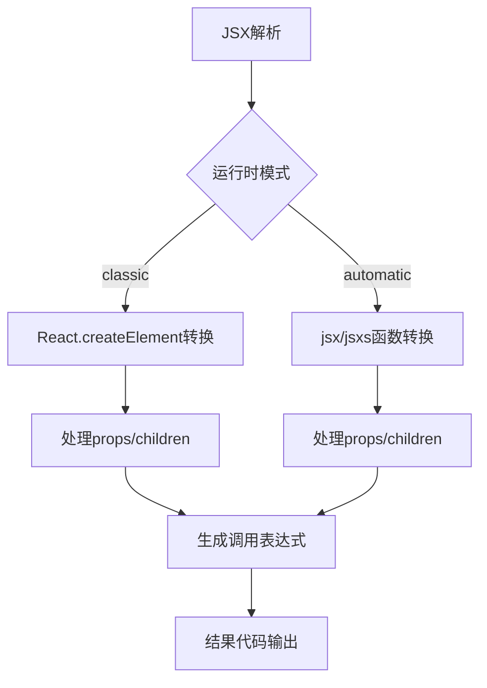

# babel-plugin-transform-react-jsx插件源码解析

这是一个Babel插件核心源码，负责将JSX语法转换为React.createElement调用或现代JSX运行时的jsx函数调用。以下是代码逻辑解析：


1. **核心功能流程图**


1. **核心模块解析**：
- **运行时模式处理**：
  - Classic模式：转换为`React.createElement(type, props, children)`
  - Automatic模式：使用`jsx()`/`jsxs()`函数（来自react/jsx-runtime）

1. **关键转换逻辑**：
```typescript
// 处理JSX元素
JSXElement.exit() {
  if (runtime === 'classic') {
    buildCreateElementCall() // 传统方式
  } else {
    buildJSXElementCall() // 现代运行时
  }
}

// 属性处理逻辑
accumulateAttribute() {
  处理普通属性 → objectProperty
  处理扩展属性 → spreadElement
}

// 开发模式增强
injectMetaPropertiesVisitor() {
  注入__source(源码位置)和__self(组件实例)
}
```

4. **配置处理逻辑**：
- 通过注释可以覆盖默认配置：
```ts
// @jsxImportSource custom-source
// @jsxRuntime automatic
// @jsx customCreateElement
// @jsxFrag customFragment
```

5. **特殊处理**：
- 对`key`属性的特殊校验
- 对Fragment的转换处理
- 开发环境添加源码位置信息
- 扩展属性(...props)的深度合并处理

这个插件实现了完整的JSX转换规范，支持传统和现代两种运行时模式，并处理了各种边界情况（如命名空间、属性扩展等），是React JSX编译的核心基础设施。