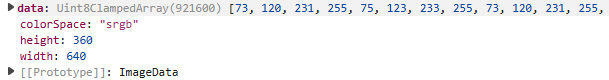

# 视频背景自动取色Demo

这个项目实现了一个视频播放器，能够自动提取视频边缘区域的颜色，并将其应用为背景色，解决了视频比例不兼容时黑边的问题。

## 功能特点

- **自动取色**：从视频帧实时提取边缘颜色
- **平滑过渡**：颜色变化时有平滑的过渡效果
- **性能优化**：自适应采样间隔，保持流畅体验
- **边缘区域分析**：分别分析四个边缘区域，获取更精准的背景色

## 实现原理

### 聚类算法版本 (script-cluster.js)

1. **Lab色彩空间聚类**：
   - 将RGB颜色转换为Lab色彩空间，更符合人眼感知
   - 基于Lab空间距离进行颜色聚类，相似颜色归为一组
   - 提取每个簇的主要颜色作为代表色

2. **边缘区域分析**：
   - 分别提取视频四边（左、右、上、下）的颜色
   - 对每个边缘区域单独进行聚类分析
   - 综合四边颜色信息，生成更自然的背景效果

3. **性能优化**：
   - 使用采样间隔减少处理的像素数量
   - 限制颜色分析的频率，避免过度消耗CPU
   - 实时监控FPS，动态调整采样参数

4. **视觉效果增强**：
   - 使用CSS渐变和模糊效果创建自然过渡
   - 实现背景色的平滑动画过渡
   - 支持半透明效果，增强视觉体验

### 颜色处理流程

```
视频帧 → Canvas绘制 → 像素数据提取 → RGB转Lab → 颜色聚类 → 
边缘区域分析 → 主色提取 → 平滑过渡 → 应用背景色
```

## 使用方法

1. 打开`index-cluster.html`文件
2. 点击"选择视频文件"按钮上传本地视频
3. 视频开始播放后，背景将自动根据视频内容变化

## 文件说明

- `index-cluster.html`: 聚类算法版本的HTML界面
- `script-cluster.js`: 基于Lab色彩空间的聚类算法实现
- `style-cluster.css`: 支持颜色过渡和边缘区域显示的样式表

## 技术细节

### Lab色彩空间

Lab色彩空间是一种知觉均匀的色彩空间，其中欧几里得距离与人类感知的颜色差异更一致。使用Lab空间进行聚类可以获得更符合人眼感知的颜色分组。

### 聚类算法

本项目使用基于距离阈值的简化聚类算法：
1. 遍历像素点，转换为Lab空间
2. 计算与现有簇的距离，如果小于阈值，加入该簇
3. 如果没有合适的簇，创建新簇
4. 计算每个簇的平均颜色作为代表色

### 性能考量

- 使用`willReadFrequently: true`优化Canvas性能
- 采用定时分析而非每帧分析，减少CPU负载
- 实现自适应采样间隔，根据FPS动态调整

## 浏览器兼容性

- 支持现代浏览器（Chrome、Firefox、Safari、Edge）
- 需要支持Canvas API和requestAnimationFrame
- 部分效果（如backdrop-filter）在旧浏览器中可能不可用

## 个人遇到的问题积累

1. 需要边界判断颜色的深浅：文字为白色时，背景色过浅，则会影响文字的展示效果
2. 边缘黑色白色需要过滤：视频的黑色和白色边缘会影响背景色的选择，需要过滤掉
3. 颜色过渡平滑：背景色的过渡需要平滑，避免突变
4. 颜色的亮度和饱和度需要控制：背景色的亮度和饱和度需要控制，避免过亮或过暗
5. canvas获取数据跨域问题：
   1. canvas获取图像数据跨域问题，需要使用Blob对象进行跨域访问
   2. videodemo/autohue.ts的loadImage
6. LAB空间最大距离，最小距离是0
   1. 阈值怎么控制，合理的范围
   2. 初始簇的选定，什么策略
7. 八叉树算法需要再理解深入一下
8. 算法的时间复杂度一定要搞清楚
   1. O(n⋅k⋅t⋅d)：n：数据点的数量（样本数量）。kk：聚类的数量（簇的数量）。tt：算法的迭代次数。dd：每个数据点的特征维度（例如RGB颜色空间中 d=3d=3）
9.  算法那边各种选型后没看到你的结果性能度量数据,做算法的说了那么多改进和选型和实时性要求，也没看到你实际的性能数据，到底什么样？？？？
10. 
```js
// 定义 Lab 空间的最远对角颜色
const lab1 = [0, -128, -128];
const lab2 = [100, 127, 127];

// 计算最大距离
const maxDistance = labDistance(lab1, lab2);
console.log('Lab 空间的最大距离:', maxDistance);
 Lab 空间的最大距离: 374.2325480232846

// K-means核心逻辑（迭代式）
while (changed && iterations < maxIterations) {
  // 重新分配所有像素点
  for (const pixel of pixels) {
    // 计算到每个簇中心的距离
    // 分配到最近簇
  }
  // 更新簇中心
}

// 增量聚类核心逻辑（流式）
for 每个像素 {
  // 计算与现有簇的距离
  if (距离 < 阈值) {
    // 合并到现有簇
    // 实时更新统计量
  } else {
    // 创建新簇
  }
}

| 需求         | K-means                          | 增量聚类                        |
|--------------|---------------------------------|-------------------------------|
| 实时性    | 较差(需多次迭代)                | 优秀(单次扫描)                |
| 帧间稳定  | 波动较大(随机初始化影响)         | 高度稳定                      |
| 资源占用  | 高(存储全部像素)                | 低(仅存储簇统计量)            |
```    

### AI项目中问题积累

1. 流式响应服务端和前端都是怎么实现的？
   1. 见示例文件
   2. 可信百科：https://adgit.src.corp.qihoo.net/MvWeb/trackjs/-/merge_requests/534/diffs#f0628c4b45023c225e9b069c959aa3bba5c0f97a
   3. sse技术：https://juejin.cn/post/7355666189475954725
2. 大模型参数解释：https://blog.csdn.net/qq_35971258/article/details/143753893
3. langchain中链间的流式输出：https://js.langchain.com/docs/how_to/functions
   1. 主要利用RunnableSequence来强制转化自定义函数为Runnables对象
   2. 自定义异步生成器函数来实现流式输出中间结果

### 选型之间的对比 数据支撑


## 演讲素材

1. 图片取色算法主要用于从图像中提取主要颜色。有许多不同的算法可以实现这个目标
2. 色彩空间的选择，为什么选择LAB
3. 提取算法的选择，实现对比为什么选择聚类算法
4. 为什么不使用现成的库？ 没有符合需求的，要求自定义边界提取，即如何处理边缘颜色
5. 滤波器原理
   1. 均值滤波器：通过在图像上滑动一个固定大小的窗口（如3x3、5x5等），计算该窗口内所有像素的平均值，然后用这个平均值替换窗口中心的像素值。这个过程可以平滑图像，减少噪声，但同时也会模糊图像的细节和边缘
   2. 高斯滤波器：线性滤波器，能够有效的抑制噪声，平滑图像。其作用原理和均值滤波器类似，都是取滤波器窗口内的像素的均值作为输出。其窗口模板的系数和均值滤波器不同，均值滤波器的模板系数都是相同的为1;而高斯滤波器的模板系数，则随着距离模板中心的增大而系数减小。所以，高斯滤波器相比于均值滤波器对图像个模糊程度较小
      1. 用于去除图像中的噪声。高斯滤波可以通过卷积来实现，卷积核为高斯分布的二维版本
6. 测试图片展示
   1. https://static.pinpai.360.cn/advip-temp/vip_preview_md5_965ab515778ea3de93c7c887fdd16ce1.html
      1. https://p1.ssl.qhimg.com/t11d1a5f2e8a606fb9a7600c1cb.jpg 
   2. https://static.pinpai.360.cn/advip-temp/vip_preview_md5_9d93169e224adc30f74c2414082635a7.html
      1. https://p1.ssl.qhimg.com/t11d1a5f2e89003b1dc0c708682.jpg
   3. https://static.pinpai.360.cn/advip-temp/vip_preview_md5_87216843971cfed9c2c493df912c0150.html
      1. https://p1.ssl.qhimg.com/t11d1a5f2e85fba0922a0d3b931.jpg
   4. https://static.pinpai.360.cn/advip-temp/vip_preview_md5_f93b887cf15ef6333d4f14905013229d.html
      1. https://p1.ssl.qhimg.com/t11d1a5f2e8398d1f9f9a1b443c.jpg
   5. https://static.pinpai.360.cn/advip-temp/vip_preview_md5_f2695f035300047405ff938f127ef6c6.html
      1. https://p1.ssl.qhimg.com/t11d1a5f2e8fdb1b2ce0726e131.png

### 技术API理解

1. canvasimageData.data 是一个 一维数组，类型是 Uint8ClampedArray。
它包含了图像中每个像素的 RGBA 信息（红、绿、蓝、透明度），每四个值代表一个像素
   1. 假设图片是 2x2 像素，那么 data 数组会有 2 * 2 * 4 = 16 个元素
   2. 
   ```js
      const data = [
        R1, G1, B1, A1,   // 第一个像素
        R2, G2, B2, A2,   // 第二个像素
        R3, G3, B3, A3,
        R4, G4, B4, A4
      ];
   ```
   
2. 卷积
   1. 对于图像的每一个像素点，计算它的邻域像素和滤波器矩阵的对应元素的乘积，然后加起来，作为该像素位置的值，图像像素点不变，3x3矩阵计算后得到的结果只替换中间那个点的值，其他不变，图像降噪中相当于把噪峰这个峰点磨平了，看起来模糊了，
   2. 卷积是滑动窗口加权求和，每次得到的是一个数。而矩阵相乘得到的是一个新矩阵  
3. 高斯相关理解
   1. 高斯相关公式原理：https://blog.csdn.net/jgj123321/article/details/94448463
   2. 高斯滤波原理讲解：https://blog.csdn.net/leonardohaig/article/details/120464251
      1. 针对边界点会扩充。保证最终得到的卷积后的像素和值与原始图像的像素和相等
      2. 与均值滤波的区别：为什么选型高斯滤波
         1. 均值滤波：就是将一个窗口区域中的像素计算平均值，然后将窗口中计算得到的均值设置为锚点上的像素值
            1. 缺点：计算均值会将图像中的边缘信息以及特征信息“模糊”掉，会丢失很多特征
         2. 高斯滤波：实质上就是一种均值模糊，只是高斯滤波是按照加权平均的，距离越近的点权重越大，距离越远的点权重越小，符合二维高斯分布
            1. 高斯滤波器相比于均值滤波器对图像个模糊程度较小，更能够保持图像的整体细节
   3. 高斯分布就是正态分布，高斯分布的概率密度函数就是分布曲线上的最小x单位上的y值，y值只是概率密度如投掷随机数，100这个数的出现次数最大分布曲线的高峰点，它的出现次数就可以类比为概率密度。
   4. 高斯分布xy坐标系上有自己的一个y=f(x)公式：公式以归一化系数与指数结构组成。就是那个以标准差和均值的公式，求任意x下的曲线y值
      1. 上面是一维高斯函数
      2. 还有个二维高斯函数，只以标准差为变量，均值一般取0方便计算，用于3维空间中运用(就不是分布曲线，而是分布线面组成的波峰立体)，如高斯滤波应用
      3. 均值：就是分布曲线的中线对应那个x值，一般取坐标原点0，方便计算，曲线关于均值对称
         1. 概念解释：https://blog.csdn.net/weixin_52734695/article/details/143035397  
      4. σ标准差的确定十分依赖于问题背景
   5. 求某一范围的概率就是：积分∫f(x)dx,就是图形下的面积，定义域范围内面积是1，概率就是1
   6. 用于去除图像中的噪声。高斯滤波可以通过卷积来实现，卷积核为高斯分布的二维版本
      1. 高斯卷积核计算：一般单个分布密度计算公式时不需要乘归一化系数，都是最后归一化，因为归一化系数不变最后可以对消
      2. 边界点处理不到问题：
         1. 零填充：填充0值，对图像边缘平滑度要求不高的情况
         2. 重复填充：复制图像边缘的像素值作为填充，适用大多数图像处理任务（如OpenCV默认使用此方法）
4. 处理图像数据时的格式类型化数组的概念：https://zh.javascript.info/arraybuffer-binary-arrays
5. 八叉树算法大致原理：见bachashu相关js文件
   1. 建立一棵空八叉树, 设置一个叶子节点个数上限
      依次将像素按 0. 的算法插入树中

      若插入后叶子节点数小于上限, 则什么也不做
      若大于上限, 则对最底层的一个非叶子节点的子节点进行合并, 将其转换为叶子节点 rgb 值的平均数, 并清除其子节点
      **根据颜色分布优先合并体积最小的节点（保留体积大的颜色）。最终保留 maxColors 种颜色（如 maxColors = 5）**
      依此类推, 直到最后插入所有的像素, 所得八叉树的叶子节点即为主色调

      该算法的核心在于, 具有兄弟关系的子节点的 rgb 每位最多都只相差 1, 即这些颜色非常接近, 所以合并后可以用更少的主色代替这几个像素的颜色
   2. 边缘取色：利用绝对像素值判断边缘区域，也可以用八叉树做边缘取色，在bachashu.js文件205行中注释
6. rgb转lab大致原理
   1. 将srgb值归一化，转化成xyz坐标
   2. 将归一化后的 XYZ 值转换为 CIELAB 空间的 L*, a*, b* 分量
      1. 利用CIELAB 空间定义的变换函数