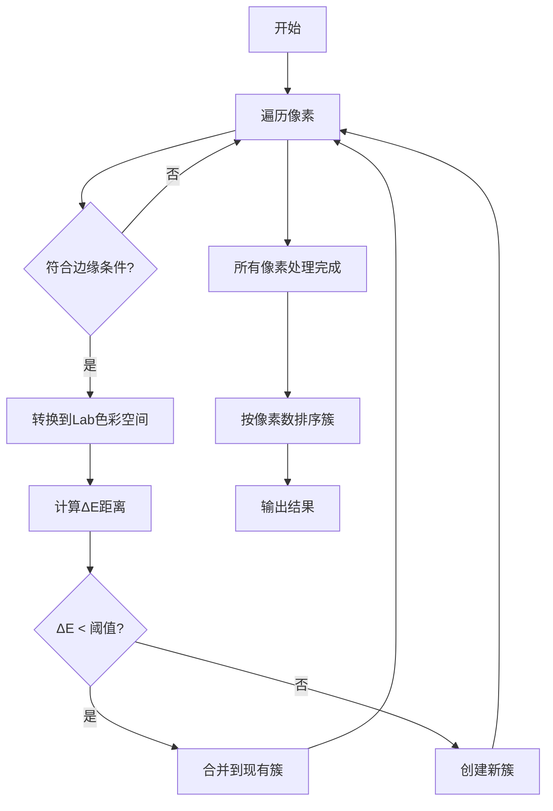

# 笔记

## 聚类算法流程图

```mermaid
graph TD
    A[开始] --> B[遍历像素]
    B --> C{符合边缘条件?}
    C -->|是| D[转换到Lab色彩空间]
    C -->|否| B
    D --> E[计算ΔE距离]
    E --> F{ΔE < 阈值?}
    F -->|是| G[合并到现有簇]
    F -->|否| H[创建新簇]
    G & H --> B
    B --> I[所有像素处理完成]
    I --> J[按像素数排序簇]
    J --> K[输出结果]
```